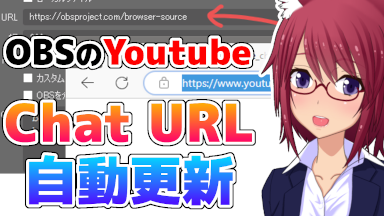

# OBS Youtube Live Stream Chat URL Updater

OBSでYoutube Live配信のチャットコメントを表示するブラウザソースのURLを自動更新するスクリプトです。 
※限定配信など公開範囲に制限があるコンテンツは情報を取得できません。

A script that automatically updates the URL of the browser source that displays Youtube Live stream chat comments in OBS. 
*Information cannot be obtained for content that has a limited range of disclosure, such as limited distribution.

---

[解説動画 / Commentary video](https://youtu.be/KnytIzi957E)

---

## 目次 / Content(s)
* ダウンロード / Download
* OBSへの導入方法 / How to install to OBS
* 設定 / Setting
* トラブルシューティング / Troubleshooting
* ライセンス / License

---

# ダウンロード / Download

[GitHubの公開ページ](https://github.com/yuki-natsuno-vt/ObsYoutubeLiveStreamChatUrlUpdater)の [ Code ] ボタンを押します。 
表示されるメニューから [ Download ZIP ]を選んで ObsYoutubeLiveStreamChatUrlUpdater-main.zip を入手してください。 
ダウンロードしたzipファイルを任意の場所に展開して下さい。 
*※パスに半角英数以外の文字が含まれるとOBSでスクリプトをロードする際にエラーになります*

Press the [Code] button on the [GitHub public page](https://github.com/yuki-natsuno-vt/ObsYoutubeLiveStreamChatUrlUpdater).  
Select [Download ZIP] from the displayed menu to obtain ObsYoutubeLiveStreamChatUrlUpdater-main.zip.  
Extract the downloaded zip file to any location. 
**Any non-alphanumeric characters in the path will result in an error while loading the script in OBS.*

---

# OBSへの導入方法 / How to install to OBS
OBS メニューの[ツール(T)]→[スクリプト]を選びます。

Select [Tools (T)] → [Scripts] from the OBS menu.

スクリプトウインドウが表示されます。 スクリプトタブの[+]を押してスクリプトファイルを追加します。

A script window will appear. Add a script file by pressing [+] on the script tab.

ダウンロードしたzipを展開したフォルダ内にある youtube-live-stream-chat-updater.lua を開きます。

Open youtube-live-stream-chat-updater.lua in the downloaded zip folder.

導入が完了しました。

Installation completed.

---

# 設定 / Setting

設定の各項目は、一度入力すると値が保持されます。 
以降はOBSを起動すると自動でURLの更新が行われます。 
※ボタンを押して手動で更新することもできます。

Each setting item retains its value once entered. 
After that, when you start OBS, the URL will be updated automatically. 
*You can also update manually by pressing the button.

## Channel URL

Channel URL にはあなたのチャンネルのトップページURL、またはライブ タブのURLを設定してください。 
トップページURLの場合、チャンネルのカスタマイズによって正常に情報を取得できない場合があります。 
その場合は、ライブ タブのURLを設定してください。 
例1) https://www.youtube.com/@yuki_natsuno_vt 
例2) https://www.youtube.com/@yuki_natsuno_vt/streams

For Channel URL, set the URL of your channel's top page or the URL of the live stream tab. 
In the case of the top page URL, information may not be obtained properly due to channel customization. 
In that case, please set the URL of the live stream tab. 
Example 1) https://www.youtube.com/@yuki_natsuno_vt 
Example 2) https://www.youtube.com/@yuki_natsuno_vt/streams

## Source name

Source name には、チャットコメントのURLを設定する、ブラウザソースの名前を設定してください。 
名前に使用できる文字は半角英数のみです。全角文字（日本語や記号）を含む場合正常に動作しません。

For Source name, set the name of the browser source that sets the chat comment URL. 
Only alphanumeric characters can be used in the name.

## Update LiveChat URL Button

ブラウザソースに設定されているチャットのURLを更新します。

Update the chat URL set in the browser source.

---

# トラブルシューティング / Troubleshooting

スクリプトウインドウの[スクリプトログ]ボタンを押すと、スクリプトログウインドウが表示されます。 
[youtube-live-stream-chat-url-updater.lua] Error ~~~ が表示されている場合は次の内容を確認してください。

When you press the [Script Log] button in the script window, the script log window is displayed. 
If "[youtube-live-stream-chat-url-updater.lua] Error ~~~" is displayed, check the following.

## [youtube-live-stream-chat-url-updater.lua] Error loading file: cannot open

パスに半角英数以外の文字が使われている可能性があります。スクリプトを配置する場所を変更してください。

Non-alphanumeric characters are used in the path. Please change the location of the script.

## [youtube-live-stream-chat-url-updater.lua] Error: Channel URL is not set.

Channel URL が設定されていません。

Channel URL is not set.

## [youtube-live-stream-chat-url-updater.lua] Error: Source name is unset.

Source name が設定されていません。

Source name is not set.

## [youtube-live-stream-chat-url-updater.lua] Error: Target source is not found. xxxxx

Source name に設定した名前のソースが見つかりません。 
※ソース名に使えるのは半角英数だけです。

The source with the name specified in Source name was not found. 
*Only single-byte alphanumeric characters can be used for the source name.

## [youtube-live-stream-chat-url-updater.lua] Error: videoId was not found.

Channel URLに誤りがあるか、指定のURLからコンテンツの情報を取得できない状態になっています。 
限定配信など公開範囲に制限があるコンテンツは情報を取得できません。

There is an error in the Channel URL, or content information cannot be obtained from the specified URL. 
Information cannot be obtained for content that has a limited range of disclosure, such as limited distribution.

## [youtube-live-stream-chat-url-updater.lua] Error: curl command is not found.

URLからページ情報を取得する curl コマンドが見つかりませんでした。 
Windows10/Macには標準でインストールされているはずですが、インストールされていないようであれば新たにインストールしてください。

I couldn't find a curl command to get page information from a URL.  
It should be installed by default on Windows 10/Mac, but if it doesn't seem to be installed, please install it again.

---

# ライセンス / License
## 要約 / Summary

MIT License での配布なので利用制限、動作損害保証ともに一切ありません。

宣伝してもらえると嬉しいです！ 
Twitter [https://twitter.com/yuki_natsuno_vt/status/1618187661428297728](https://twitter.com/yuki_natsuno_vt/status/1618187661428297728)

Since it is distributed under the MIT License, there are no usage restrictions, operation guarantees, or damage guarantees.

I would be happy if you could promote it! 
Twitter [https://twitter.com/yuki_natsuno_vt/status/1618187661428297728](https://twitter.com/yuki_natsuno_vt/status/1618187661428297728)